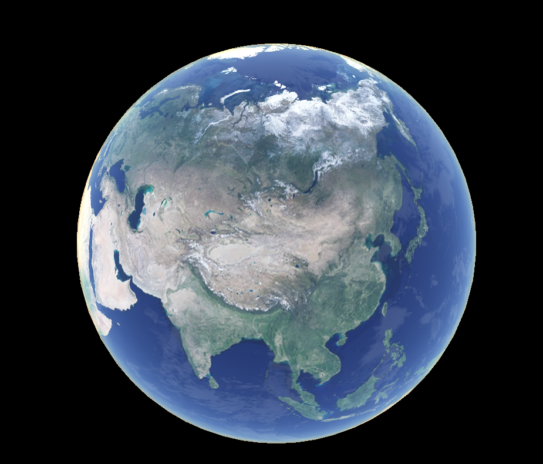
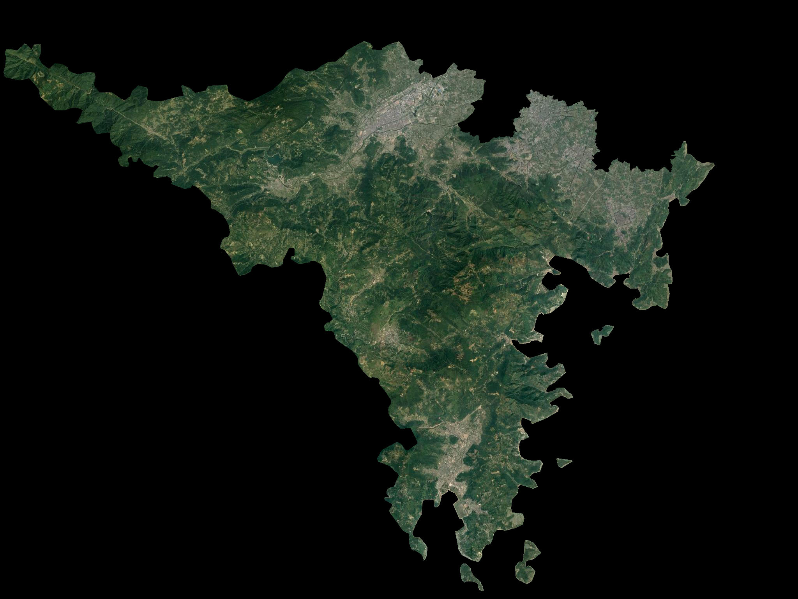

# googleMapDownloader
下载谷歌地图数据（卫星、路网）

教程查看[python 下载 google 卫星影像（经纬度、瓦片）](https://mybestlove.github.io/2021/08/02/python%E4%B8%8B%E8%BD%BDgoogle%E5%8D%AB%E6%98%9F%E5%BD%B1%E5%83%8F%EF%BC%88%E7%BB%8F%E7%BA%AC%E5%BA%A6%E3%80%81%E7%93%A6%E7%89%87%EF%BC%89/)

2019全国行政区域[地址](https://pan.baidu.com/s/13N-febNMF01PctN3tXob-Q)，提取码：9z6d